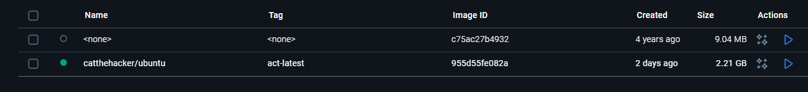

### Cómo vamos a Definir el contrato de datos

Para estar seguros de que solo aceptamos datos buenos, creamos un sistema de reglas y pruebas.

  * **Creamos "Contratos" con Pydantic:** Usamos una herramienta llamada Pydantic para definir cómo deben verse nuestros datos. Básicamente, escribimos reglas como:
      * Un `LogEvent` (evento de log) **debe** tener un campo `level`.
      * Ese `level` **solo** puede ser "INFO", "WARN", "ERROR", etc.
      * Un `MetricEvent` (evento de métrica) **no puede** tener un valor negativo.
  * **Probamos las Reglas:** Escribimos pruebas (`pytest`) para asegurarnos de que el vigilante haga bien su trabajo:
    1.  **Prueba a efectividad:** Le enviamos datos perfectos y comprobamos que los acepte.
    2.  **Prueba a error:** Le enviamos datos malos y comprobamos que los rechace.
  * **Hicimos que las Pruebas Funcionen:** Las pruebas no podían encontrar el código `src`. Para arreglarlo, creamos el archivo `pytest.ini`.
 

### Cómo vamos a Automatizar y Estandarizar Utiilizando Makefile y venv
Vamos a generar makefile para definir "recetas" o comandos simples para las tareas más comunes.
    * `make setup`: Prepara el entorno virtual e instala *todas* las dependencias.
    * `make lint`: Ejecutara `flake8` para revisar la calidad del código.
    * `make test`: Lanzara las pruebas con `pytest` y genera un reporte de coverage(Para fase inicial esta bien con u porcenaje bajo).

    1.  **requirements.txt:** librerías necesarias para que la aplicación funcione en producción
    2.  **requirements-dev.txt:** herramientas para desarrollar, probar y formatear el código

* **Estandarizamos las herramientas de IaC (Terraform):** El `Makefile` también soluciona el problema de "en mi máquina funciona".
    1.  **Instalación Local:** El target `install-iac-tools` descarga versiones *específicas* de `tflint` (linter) y `tfsec` (seguridad) ** El target `validate-iac` usa esas herramientas locales de Terraform por el momento no esta implementado

* Se encontraron errores estructurales en base a `lint` fueron solucionados mediante comando `black src tests` en consola
### Implementacion de Dockerfile para collector 

* Se asignos una composicion de dockerfile para collecto a continuacion se va poder continuar con la implementacion de terraform para esta variante y asu vez se continuaran con la creacion de dockerfile para los demas servicios

## Ampliacion de makefile y CI-CD
La ampliación de la automatización se centró en **centralizar los comandos** y **gates de calidad en CI/CD**.

* **Makefile Ampliado:** Se añadieron comandos de ciclo de vida completo (`setup`, `build`, `pack`, `clean`) y comandos de gestión de la infraestructura como código (IaC) de Terraform: `plan`, `apply`, `destroy` y `validate-iac`.

* **Pipeline CI/CD (GitHub Actions) Reforzado:** El flujo se dividió en tres *jobs* con dependencias:
    1.  **`quality`:** Ejecuta `make lint` y `black --check` (formato).
    2.  **`test`:** Ejecuta `make test` para verificar las pruebas unitarias y el **coverage** ($\ge 85\%$).
    3.  **`validate-iac`:** Incluye el paso de **instalar Terraform** (usando `hashicorp/setup-terraform`) para luego ejecutar `make validate-iac`, asegurando la validación del código de infraestructura (`terraform validate`, `tflint`, `tfsec`) en cada *push*.

* A su vez una verificacion localmente con act

