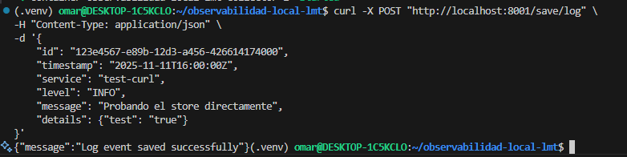
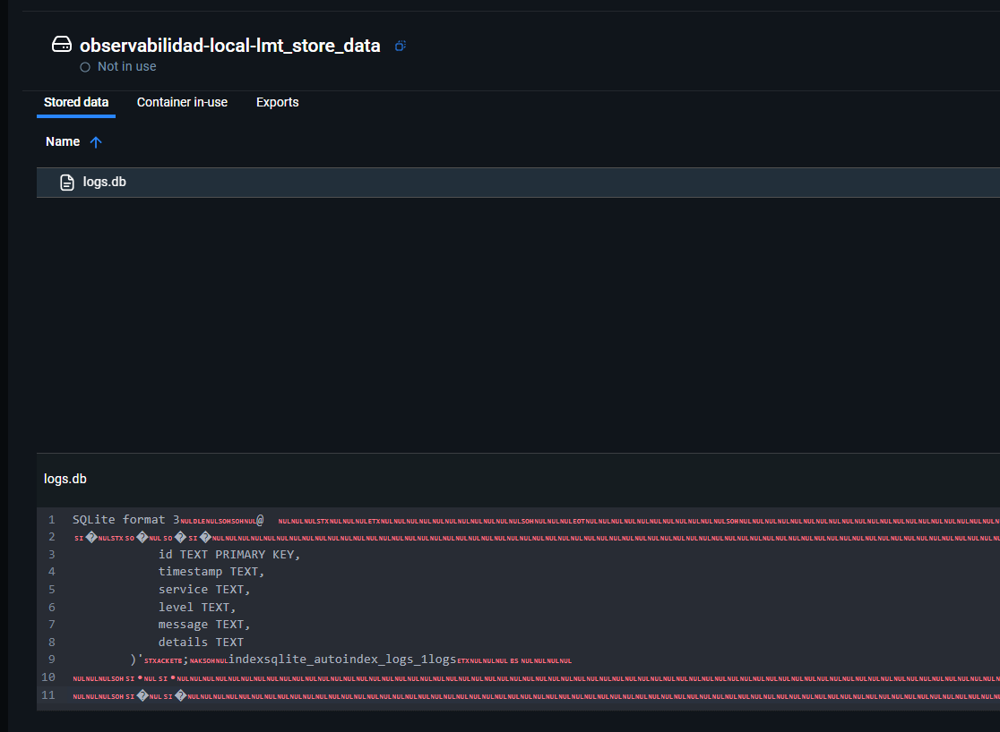
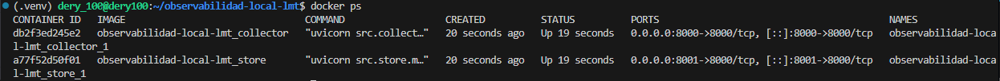

## Implementacion de persistencia Store
En este paso logramos construir el servicio store para guardar permanentemente los logs.
* en codigo Creamos src/store/main.py. Su trabajo es simple: define la URL POST /save/log y guarda cualquier log que reciba en una base de datos SQLite.
* Creamos su dockerfile y su módulo de Terraform para el modulo Store.
* Para obtener una Persistenci usamos volúmenes en docker-compose.yml y Terraform para que la base de datos no se borre al apagar el contenedor.


* La Conexión: Le decimos a docker-compose.yml y a main.tf que "enciendan" y gestionen el nuevo servicio store.


## Implementar Ingesta (Collector)
* Se implementó el endpoint para recibir logs en formato `LogEvent` y validarlos usando Pydantic.
* El endpoint valida el `LogEvent` y lo envía al Store Service para su almacenamiento.
* Se utilizó Pydantic para validar los datos del log recibido, asegurando que el formato y los tipos sean correctos.
* El `LogEvent` validado se envía al Store utilizando un cliente HTTP (usando `httpx`).
* Si el envío del log al Store falla, el Collector registra el error, pero siempre devuelve un estado `{"status": "ok"}` al cliente para no interrumpir el flujo.
1. Verificar que el servicio está en funcionamiento (Para el Collector y el Store)
```bash
docker ps

```


2. Verificar el estado del Collector (Acceder al endpoint /health) y Enviar un log al Collector (Verificar que el log sea recibido y enviado al Store)

