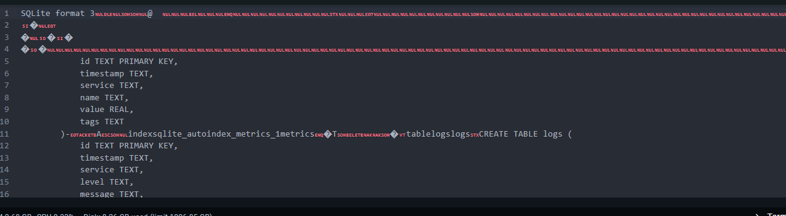
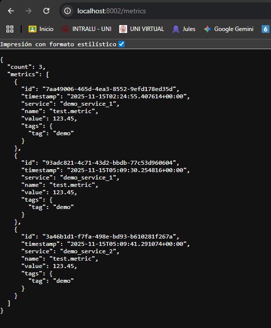

## Implementacion de metricas en Sql y flujo


### Genera la telemetría

Ahora usamos, los servicios demo para que envíen datos al Collector  a los puertos `8003` y `8004` en el `docker-compose.yml`:
**Llama al Demo Service 1 (en `localhost:8003`):**

```bash
# Envía un log
curl http://localhost:8003/log
# Envía una métrica
curl http://localhost:8003/metric
# Envía una traza
curl http://localhost:8003/trace
```

** Demo Service 2 (en `localhost:8004`):**

```bash
# Envía un log
curl http://localhost:8004/log
# Envía una métrica
curl http://localhost:8004/metric
# Envía una traza
curl http://localhost:8004/trace
```

Abrimos y vamos a los endpoints de **Viewer** (que corre en el puerto `8002`).

**1. Para ver los LOGS:**
Abrimos `http://localhost:8002/logs`

  * **Notamos:** Un JSON con los logs de **ambos** servicios (`demo_service_1` y `demo_service_2`).

**2. Para ver las MÉTRICAS:**
Abrimos `http://localhost:8002/metrics`

  * **Notamos:** Un JSON con las métricas de **ambos** servicios.

**3. Para ver las TRAZAS:**
Abrimos `http://localhost:8002/traces`

  * **Notamos:** Un JSON con las trazas de **ambos** servicios.





